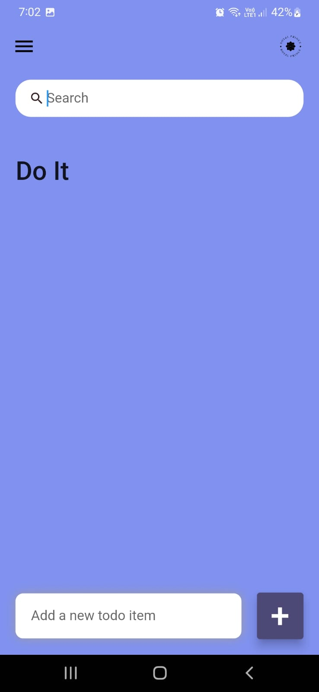
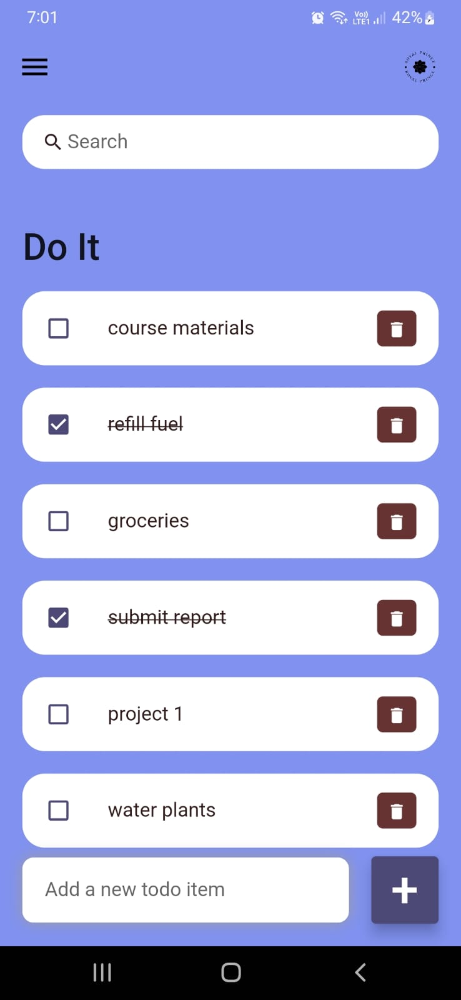
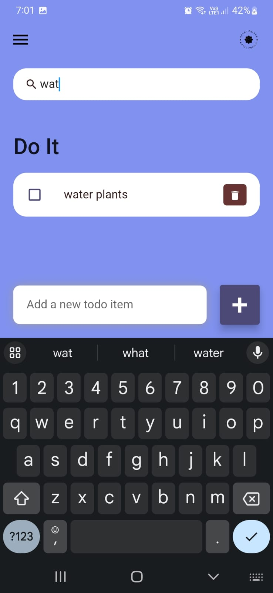

# Doyit - Cross-Platform Goal Tracking App


# Screenshots




Doyit is a versatile cross-platform goal tracking application that allows you to set and track an unlimited number of goals. With Doyit, you can easily monitor your progress, mark completed goals, and keep yourself motivated to achieve your objectives. Say goodbye to the hassle of deleting goals and enjoy a seamless goal management experience.

## Features

- **Unlimited Goals:** Set as many goals as you want, whether they are personal, professional, or related to any aspect of your life.

- **Easy Goal Management:** Mark goals as completed without the need to delete them. Keep a record of your accomplishments over time.

- **Search Functionality:** Quickly find specific goals using the built-in search feature. Easily locate and access your goals, even if you have a long list.

## Platforms Supported

Doyit is a cross-platform application, available for:

- **iOS**
- **Android**

## Installation

To install Doyit, you can clone this GitHub repository:

```bash
git clone https://github.com/R0yalPrince/doyit.git
cd doyit
```

## Usage
Once you have cloned the repository and set up the app, you can start using Doyit to manage your goals. Make sure to follow any additional instructions provided in the project's documentation.

## License

This project is licensed under the MIT License.

## Acknowledgments

We would like to express our gratitude to the open-source community for their contributions and inspiration.

---

